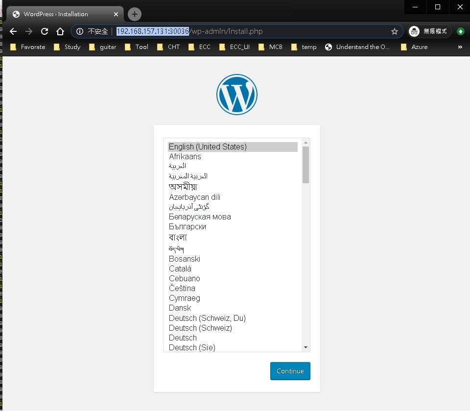

# docker-compose 
---
##### docker-compose command to create containers and run in backround 
    $ docker-compose up -d
##### docker-compose command to show running containers
    $ docker-compose ps
##### docker-compose command to stop containers
    $ docker-compose stop
##### docker-compose command to remove containers
    $ docker-compose rm
##### if you modify the docker-compose.yaml file just restart the service. it will become effective
    $ docker-compose restar <service ex:db>

## volumes
---
- While you remove containers the volume dokcer-compose created will not be acturlly remove. 
##### Command to show where volumes is (the volume acturlly path is in windows vm. )
    $  docker inspect -f '{{range .Mounts}}{{.Source}}{{end}}' <containerId>    
        /var/lib/docker/volumes/wordpress_db_data/_data
##### show volume status 
    $ docker volume ls 
    $ docker volume inspect <wordpress_db_data>
##### let volmes splite from container 
    $ docker-compose down --volumes
##### delete all volumes permanently  
    $ docker volume prune
    ##### WARNING! This will remove all local volumes not used by at least one container.
    Are you sure you want to continue? [y/N] y

##### while using windows K8s the volume will locate in C:\Users\jerry\.docker\Volumes
    PS D:\workspace\wordpress> docker inspect -f '{{range .Mounts}}{{.Source}}{{end}}' 53d70322b90f    
    /var/lib/kubelet/pods/34968a80-3ce8-11ea-adb3-00155d6d0107/containers/mysql/7c736abb/host_mnt/c/Users/jerry/.docker/Volumes/mysql-pv-claim/pvc-349664c5-3ce8-11ea-adb3-00155d6d0107/var/lib/kubelet/pods/34968a80-3ce8-11ea-adb3-00155d6d0107/volumes/kubernetes.io~secret/default-token-x4mkh/var/lib/kubelet/pods/34968a80-3ce8-11ea-adb3-00155d6d0107/etc-hosts

# K8s
---
### installation 
    $sudo snap install microk8s --classic
    $sudo snap alias microk8s.kubectl kubectl
    sudo microk8s.enable storage
### deployment nginx
    $ kubectl create -f nginx-deployment.yaml
        deployment.apps/nginx-deployment created

    $ kubectl get deployments/nginx-deployment -o yaml
# ReplicaSet
    $kubectl get rs -o wide
    NAME                          DESIRED   CURRENT   READY   AGE     CONTAINERS   IMAGES         SELECTOR
    nginx-deployment-66f7f56f56   2         2         2       2m41s   nginx        nginx:1.15.4   app=nginx,pod-template-hash=66f7f56f56
# Pod 
    $ kubectl get pods -o wide
    NAME                                READY   STATUS    RESTARTS   AGE   IP         NODE             NOMINATED NODE   READINESS GATES
    nginx-deployment-66f7f56f56-h52m8   1/1     Running   0          13m   10.1.0.6   docker-desktop   <none>           <none>
    nginx-deployment-66f7f56f56-pl5b6   1/1     Running   0          13m   10.1.0.5   docker-desktop   <none>           <none>
# Container
    $ kubectl exec -it nginx-deployment-66f7f56f56-h52m8 bash
    root@nginx-deployment-66f7f56f56-h52m8:/# ls
    bin  boot  dev  etc  home  lib  lib64  media  mnt  opt  proc  root  run  sbin  srv  sys  tmp  usr  var

# deployment service hello 
---
### running service
    $kubectl create -f .\hello-service.yaml
    service/hello created

### get service
    $ kubectl get service -o wide
        NAME         TYPE        CLUSTER-IP     EXTERNAL-IP   PORT(S)   AGE    SELECTOR
        hello        ClusterIP   10.99.166.10   <none>        80/TCP    13s    app=nginx
        kubernetes   ClusterIP   10.96.0.1      <none>        443/TCP   154m   <none>
        
### delete service
    $ kubectl delete -f .\nginx-deployment.yaml
        deployment.apps "nginx-deployment" deleted

### show logs
    $ kubectl logs frontend-895c8799c-ckdvc
    2019/12/11 00:39:01 [emerg] 1#1: host not found in upstream "hello" in /etc/nginx/conf.d/frontend.conf:2
    nginx: [emerg] host not found in upstream "hello" in /etc/nginx/conf.d/frontend.conf:2

# Deploy wordpress and mysql   
###### (https://kubernetes.io/docs/tutorials/stateful-application/mysql-wordpress-persistent-volume/ )
---
### Deploy sequencely
    $kubectl create secret generic mysql-pass --from-literal=password=chttl232
    $kubectl create -f .\mysql-deployment.yaml
    $kubectl create -f .\wordpress-deployment.yaml
    
### Or you can combine two yaml files above into one kustomization.yaml then  
    $ kubectl apply -k ./               //kustomization.yaml
        secret/mysql-pass-m6cckc2mch created
        service/wordpress-mysql created
        service/wordpress created
        deployment.apps/wordpress-mysql created
        deployment.apps/wordpress created
        persistentvolumeclaim/mysql-pv-claim created
        persistentvolumeclaim/wp-pv-claim created

###  Debugging
> https://kubernetes.io/docs/tasks/debug-application-cluster/debug-application-introspection/)
    $ kubectl get events
    $ kubectl describe pod
    $ kubectl logs <podsName>
### Verify that a PersistentVolume
    $ kubectl get pvc
    NAME             STATUS    VOLUME                                     CAPACITY   ACCESS MODES   STORAGECLASS       AGE
    mysql-pv-claim   Bound     pvc-8cbd7b2e-4044-11e9-b2bb-42010a800002   20Gi       RWO            standard           77s
    wp-pv-claim      Bound     pvc-8cd0df54-4044-11e9-b2bb-42010a800002   20Gi       RWO            standard           77s
### Verify that the Pod    
    $kubectl get pods
### Verify service 
    $kubectl get services wordpress
    
###  Stop 
    $kubectl get deployments
        NAME              READY   UP-TO-DATE   AVAILABLE   AGE
        wordpress         1/1     1            1           52m
        wordpress-mysql   1/1     1            1           52m
    $ kubectl scale --replicas=0 deployments/wordpress
        deployment.extensions/wordpress scaled
    $ kubectl scale --replicas=0 deployments/wordpress-mysql
        deployment.extensions/wordpress-mysql scaled

### Cleaning up
**Run the following command to delete your Secret, Deployments, Services and PersistentVolumeClaims:**

    $ kubectl delete -k ./

> **'type: loadbalance' is used for public cloud ;  'type: NodePort' let you export service pods  to other services in the same node.**

# K8s commands to show status
    $ kubectl describe pods
    $ kubectl get service -o wide
    $ kubectl get secrets
    $ kubectl get pvc
    $ kubectl get deployments
    $ kubectl get pods
    $ kubectl get nodes
    $ kubectl config view
    $ kubectl config get-contexts
    $ kubectl config use-context docker-for-desktop

# reference : 
---
- Local Kubernetes for Windows — MiniKube vs Docker Desktop
https://medium.com/containers-101/local-kubernetes-for-windows-minikube-vs-docker-desktop-25a1c6d3b766

- https://github.com/kubernetes/dashboard
kubectl apply -f https://raw.githubusercontent.com/kubernetes/dashboard/v1.10.1/src/deploy/recommended/kubernetes-dashboard.yaml
kubectl proxy

- kubectl -n kube-system describe secret $(kubectl -n kube-system get secret | grep admin-user | awk '{print $1}')

- http://localhost:8001/api/v1/namespaces/kube-system/services/https:kubernetes-dashboard:/proxy/#!/overview?namespace=default

